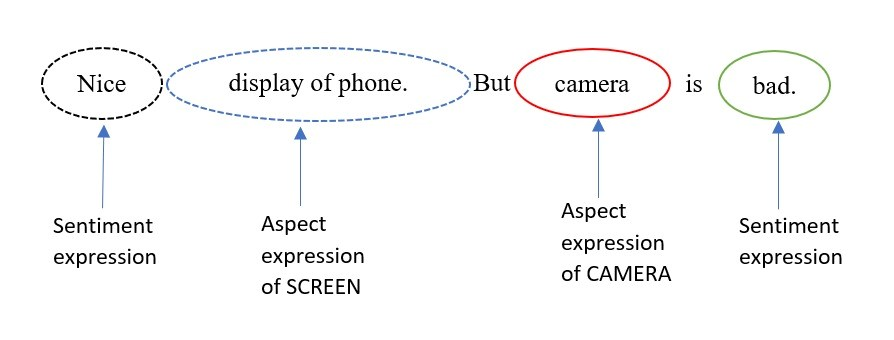
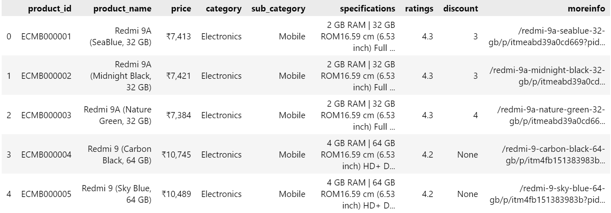
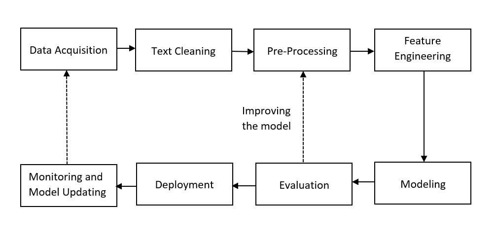
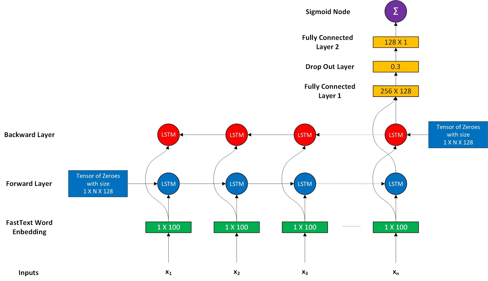

# Aspect Based Sentiment Analysis

Aspect-based sentiment analysis (ABSA) is a text analysis technique that categorizes data by aspect and identifies the sentiment attributed to each one.

 

## Table of Content

* [About The Project](#1)
* [About Data](#2)
* [Methodology](#3)
    - [Model Architecture](#3.1)
* [Results](#4)
* [Deployment](#5)
* [Reference](#6)

## About the Project 

Aspect-based sentiment analysis (ABSA) is a text analysis technique that categorizes data by aspect and identifies the sentiment attributed to each one. We will use it to analyze customer feedback for Flipkart products by associating specific sentiments with different aspects of a product or service. 

Aspect Based Sentiment Analysis can be categorized into two types:-
-	Supervised ABSA:- In the Supervised approach we provide the seed words which then help the supervised model extract aspects of the sentence. If it identifies the particular aspects of that seed then it tags those sentences with those aspects.

-	Unsupervised ABSA:- As it is obvious providing the seed for each sentence is a difficult task plus let's say if our dataset is large (20-100k) then that will become a nightmare. Topic Modeling is the technique that helps extract latent topics from a document, in our case, we will extract aspects from a sentence using topic modeling techniques such as the latent Dirichlet algorithm (LDA).

## About the Data 

The Dataset is self-created(Scrapped from Flipkart Using Python) [Flipkart Cell Phone Reviews](https://www.kaggle.com/datasets/nkitgupta/flipkart-cell-phone-reviews)

The data is fetched from the Flipkart India web page contains 83 tables of which 1 table contains information about the rest 82 tables. The rest 82 tables contain reviews of 82 mobile phones.

**Item: A table which contains information about mobile phones has the following attributes.**

-	product_id    
-	product_name  
-	price         
-	category      
-	sub_category  
-	specifications
-	ratings       
-	discount      
-	moreinfo

**Tables containing reviews of 82 mobile phones have the following attributes.**

-	product_id  
-	review_id   
-	title       
-	review      
-	likes       
-	dislikes    
-	ratings     
-	reviewer

To overcome the above challenges various approaches were used(see the notebook for more deep understanding). 

## Methodology 

Aspect Based Sentiment Analysis is a Natural Language Processing (NLP) Based Approach so we will deal with it like that and follow the below-mentioned pipeline for an NLP task.

For the detailed understanding of above mentioned pipeline please visit the notebook given above.

### Model Architecture 

## Results 

## Deployment 

## Reference 

- [A Practical Introduction to Web Scraping in Python](https://realpython.com/python-web-scraping-practical-introduction/)
- [Python SQLite](https://www.geeksforgeeks.org/python-sqlite/)
- [What on Earth is Unicode Normalization?](https://towardsdatascience.comwhat-on-earth-is-unicode-normalization-56c005c55ad0)
- [How to handle Emoji ‘😄’ & Emoticon ‘ :-) ’ in text preprocessing?](https://medium.com/geekculture/text-preprocessing-how-to-handle-emoji-emoticon-641bbfa6e9e7)
- [Spelling checker in Python](https://www.geeksforgeeks.org/spelling-checker-in-python/)
- [NLPAUG – A Python library to Augment Your Text Data](https://www.analyticsvidhya.com/blog/2021/08/nlpaug-a-python-library-to-augment-your-text-data/)
- [Topic Modeling in Python: Latent Dirichlet Allocation (LDA)](https://towardsdatascience.com/end-to-end-topic-modeling-in-python-latent-dirichlet-allocation-lda-35ce4ed6b3e0)